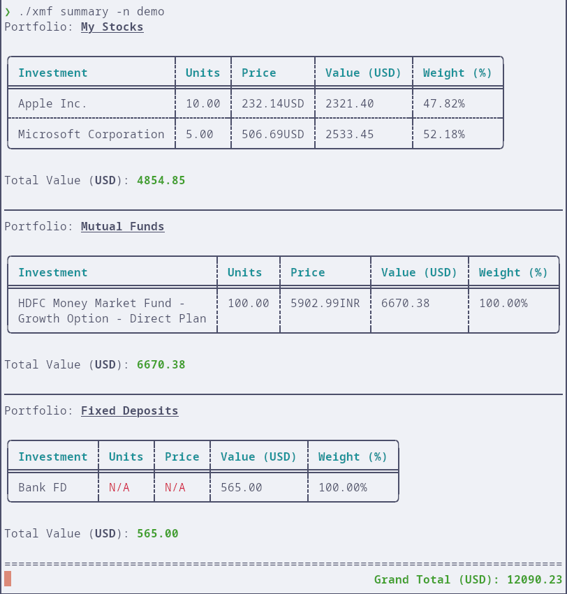

# xmf - A Simple Mutual Funds and Stocks Tracker

A command-line application written in Rust for tracking your investment
portfolios including stocks, mutual funds, and fixed deposits.




## Features

- Track multiple portfolios using a simple YAML-based configuration
- Support for multiple investment types:
  - Stocks (using Yahoo Finance tickers)
  - Mutual funds (using ISIN codes for Indian mutual funds)
  - Fixed deposits (manually updated values)
- Multiple data backends:
  - Yahoo Finance API for stock prices
  - AMFI (Association of Mutual Funds in India) for Indian mutual fund data
- Portfolio analytics:
  - Current portfolio value and allocation
  - Price change tracking over different periods
  - CAGR (Compound Annual Growth Rate) calculations
  - Expense ratio tracking for mutual funds
  - Asset allocation breakdown by category

[Screenshots](./docs)

## Installation

### From Source

1. Clone this repository:

   ```bash
   git clone https://github.com/codito/xmf.git
   cd xmf
   ```

2. Build and install using Cargo:
   ```bash
   cargo install --path .
   ```

### Pre-built Binaries

Pre-built binaries for Linux, Windows, and macOS are available with each [release](https://github.com/codito/xmf/releases).

Commands to download latest releases:

```bash
# Linux
wget https://github.com/codito/xmf/releases/latest/download/xmf-x86_64-linux.tar.gz \
  && tar xvzf xmf-x86_64-linux.tar.gz && mv xmf-x86_64-linux xmf
./xmf

# MacOS
curl -L https://github.com/codito/xmf/releases/latest/download/xmf-x86_64-macos.tar.gz \
  -o xmf.tar.gz && tar xvzf xmf.tar.gz && mv xmf-x86_64-macos xmf
./xmf

# Windows (PowerShell)
Invoke-WebRequest -Uri "https://github.com/codito/xmf/releases/latest/download/xmf-x86_64-windows.exe.zip" -OutFile "xmf.zip"
Expand-Archive -Path "xmf.zip" -DestinationPath "."
Rename-Item -Path "xmf-x86_64-windows.exe" -NewName "xmf.exe"
xmf.exe
```

## Quick Start

1. Initialize the configuration:

   ```bash
   xmf setup
   ```

   This creates a default configuration file at the appropriate location for your system.

2. Edit the configuration file to add your investments:

   ```bash
   # Location varies by OS:
   # Linux: ~/.config/xmf/config.yaml
   # macOS: ~/Library/Application Support/in.codito.xmf/config.yaml
   # Windows: %APPDATA%\codito\xmf\config.yaml
   ```

3. View your portfolio summary:
   ```bash
   xmf summary
   ```

## Configuration

The configuration file uses YAML format and supports multiple portfolios. You
can find a complete example configuration in
[`docs/example_config.yaml`](docs/example_config.yaml).

After running `xmf setup`, you'll get a configuration file with detailed
comments explaining each section. Here's a minimal example:

```yaml
portfolios:
  - name: "My Stocks"
    investments:
      - symbol: "AAPL"
        units: 10
      - symbol: "MSFT"
        units: 5
  - name: "Indian Mutual Funds"
    investments:
      - isin: "INF109K01VD2"
        units: 100
  - name: "Fixed Deposits"
    investments:
      - name: "Bank FD"
        value: 50000
        currency: "INR" # will get converted to global currency

currency: "USD" # global currency is used for all reporting
```

`xmf` supports multiple investment profiles with named configuration files.
E.g., `xmf summary -n <config_name` will use the configuration `~/.config/xmf/config_name.yml`.

### Investment Types

1. **Stocks**: Use the `symbol` field with a Yahoo Finance ticker symbol
2. **Mutual Funds**: Use the `isin` field with the fund's ISIN code
3. **Fixed Deposits**: Use `name`, `value`, and optionally `currency`

### Providers Configuration

You can customize the API endpoints used by the application:

```yaml
providers:
  yahoo:
    base_url: "https://query1.finance.yahoo.com"
  amfi:
    base_url: "https://mf.captnemo.in"
```

## Commands

- `xmf setup`: Create a default configuration file
- `xmf summary`: Display portfolio summary with current values
- `xmf change`: Show price changes over different periods
- `xmf returns`: Calculate CAGR (Compound Annual Growth Rate) for investments,
  or rolling returns with `--rolling <period>`
- `xmf fees`: Display expense ratios for mutual funds
- `xmf alloc`: Show asset allocation breakdown by category

### Global Options

- `-v, --verbose`: Enable verbose logging
- `-r, --refresh`: Force refresh of cached data
- `-n, --config-name <NAME>`: Use a named configuration file
- `--config-path <FILE>`: Use a custom configuration file path

## Data Sources

- [Yahoo Finance](https://finance.yahoo.com/) for stock prices
- [AMFI](https://www.amfiindia.com/) for Indian mutual fund data (via [captnemo's API](https://mf.captnemo.in))

## License

MIT
